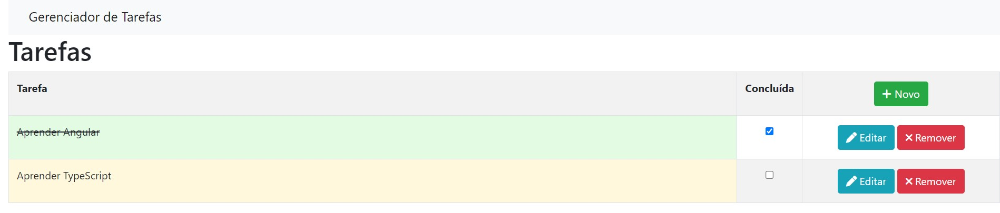

# Gerenciador de Tarefas

Gerenciador de Tarefas Básico com o  [Angular CLI](https://github.com/angular/angular-cli) versão 15.1.4

[Bootstrap](https://getbootstrap.com/docs/4.6/getting-started/introduction/) versão 4.6.2

TypeScript versão 4.9.5

## Servidor de Desenvolvimento

Rode `ng serve` para o servidor de desenvolvimento. Para visualização no browser, digite `http://localhost:4200/`. A aplicação irá rodar automaticamente e recarregar se houver alguma mudança nos arquivos.

## Build

Rode `ng build` para fazer uma build do Projeto. A build estará localizada no diretório `dist/`.

## Realizando testes

Rode `ng test` para executar testes de unidades via [Karma](https://karma-runner.github.io).

## Autor ✒️

Sérgio Júnior

